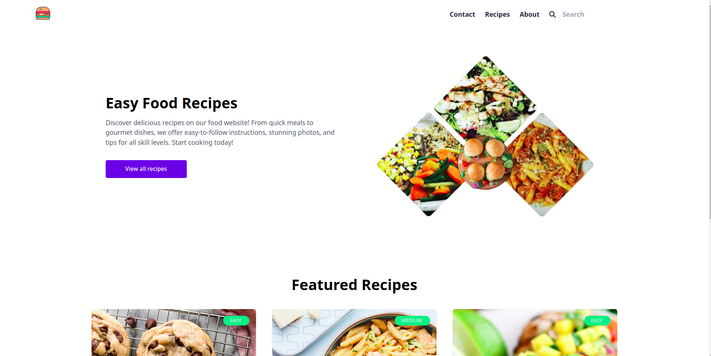
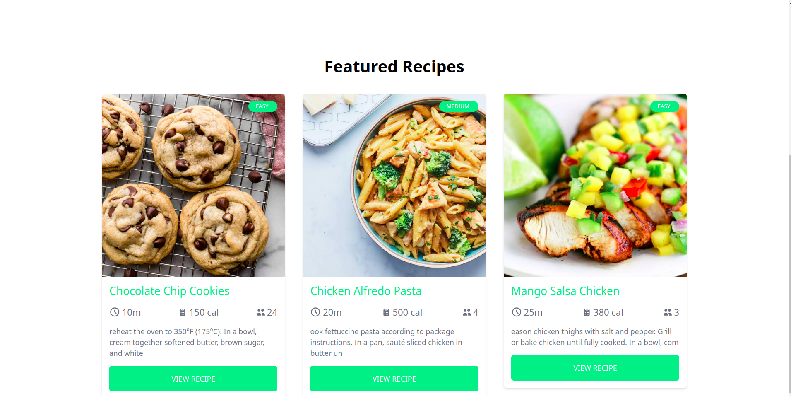

## Food Recipe App
It is a food recipe app made with Django and reactJS. The data is fetched from an external API and populated into the database. 
Tech stack:
- Django/DRF
- ReactJS
- PostgreSQL

### Backend Setup
- Go to backend folder.
- Create .env in backend folder and create required environment variables including database in postgres.
- Create a new virtual environment: `python -m venv .venv`
- Activate virtual environment: `source .venv/bin/activate`
- Install packages: `pip install -r requirements.txt`
- Run migrations: `python manage.py migrate`
- Start server: `python manage.py runserver`

### Frontend Server
- Go to frontend foler.
- Install packages. `npm install`
- Run server: `npm run dev`